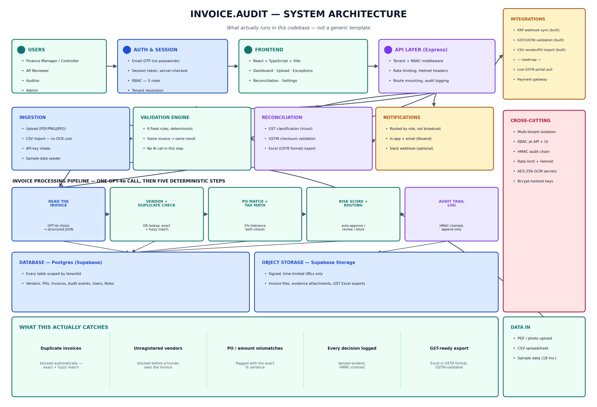

# Invoice.Audit

Invoice.Audit is a multi-tenant invoice fraud-detection and GST compliance platform for finance/AP (accounts payable) teams. It reads an invoice (OCR or CSV), runs it through a deterministic six-rule validation engine, routes anything suspicious to the right reviewer, and keeps a tamper-evident record of every decision — before the payment goes out, not after.

This repository ships **two workspaces**:

| Workspace | Route prefix | Requires setup? | What it's for |
|---|---|---|---|
| **Demo** | `/demo/*` | No — works with `npm install` alone | Static, pre-seeded sample data. Safe to explore the UI with zero configuration. |
| **Enterprise** | `/app/:tenantSlug/*` | Yes — see [Setup](#setup) below | The real multi-tenant product: Postgres-backed, OTP login, live GPT-4o OCR, live validation. |

---

## Table of Contents

1. [Features](#features)
2. [Tech Stack](#tech-stack)
3. [Architecture](#architecture)
4. [Prerequisites](#prerequisites)
5. [Setup](#setup)
6. [Available Scripts](#available-scripts)
7. [How to Use It — Two Paths](#how-to-use-it--two-paths)
8. [End-to-End Workflow](#end-to-end-workflow)
9. [Sample / Mock Data](#sample--mock-data)
10. [Project Structure](#project-structure)
11. [Main Routes](#main-routes)
12. [Testing](#testing)
13. [Known Limitations](#known-limitations-current-state)
14. [License](#license)

---

## Features

- OTP-based authentication with email/domain-based tenant resolution — no passwords
- Three ways to bring invoices in: PDF/image upload (GPT-4o Vision OCR), CSV import, or API key intake
- A six-rule deterministic validation engine: vendor master check, duplicate detection (exact + fuzzy), PO three-way match, tax/line-item math, approval-policy threshold, evidence requirement
- Risk scoring with explainable flags — every flag names the exact rule that fired and why
- Exceptions queue with inline approve / escalate / request-evidence actions (no second screen)
- HMAC-SHA256 chained audit trail — append-only and tamper-evident by construction
- Vendor portal with expiring tokens, so vendors can upload evidence without an account
- GST reconciliation: GPT-4o extraction, GSTIN format validation against the official 15-character checksum, Excel (GSTR-format) export
- Role-based access control: AP Reviewer, Finance Manager, Controller, Auditor, Admin — enforced at both the API and UI layer
- Team management, vendor master, purchase orders, an ERP webhook connector, API keys, Stripe billing
- In-app, email (Resend), and Slack notifications routed by role

## Tech Stack

| Layer | Technology |
|---|---|
| Frontend | React, TypeScript, Vite, TanStack Query, Tailwind CSS, shadcn/ui, Radix UI, React Router |
| Backend | Node.js, Express, TypeScript |
| ORM / Database | Prisma → PostgreSQL (built and tested against Supabase) |
| File storage | Supabase Storage (signed, time-limited URLs) |
| OCR / AI | OpenAI GPT-4o Vision API — the only place an AI model is called in the entire system |
| Email | Resend API |
| Testing | Vitest, Playwright |

## Architecture



- **Multi-tenancy**: every database table is scoped by `tenantId`. A session token is validated against the tenant slug on every single request — one company's data is never queryable from another company's session.
- **RBAC**: enforced twice — once at the Express middleware layer (`requireEnterpriseAccess(permission)` in `server/index.ts`), and again at the React UI layer (`usePermissions()` / `<IfAllowed>` in `src/lib/permissions.ts`).
- **The validation engine is deterministic, not an AI call.** `server/services/validationEngine.ts` runs six fixed rules against the tenant's own Postgres data. The same invoice run twice produces the same result twice — that's intentional, because an auditor needs a decision they can reproduce.
- **OCR is the only AI call in the system.** `server/services/ocr.ts` sends the raw invoice file to OpenAI's GPT-4o Vision model and gets back structured JSON (vendor, amount, dates, line items). It never makes an approval or risk decision — that's the validation engine's job, on purpose.
- **The audit trail is append-only by construction**, not just by policy: `server/db.ts` throws a runtime error on any `update`, `delete`, or `upsert` against the `AuditEvent` model outside of test mode. Each event's hash is computed from its own content plus the previous event's hash (an HMAC-SHA256 chain), so altering history breaks the chain for everything after it.

## Prerequisites

- Node.js 18 or later
- A PostgreSQL database — this project is built and tested against [Supabase](https://supabase.com)'s free tier, but any Postgres instance works
- An [OpenAI](https://platform.openai.com) API key with GPT-4o Vision access — **only required if you want to test real OCR or GST extraction.** The demo workspace and the sample-data seeder never call OpenAI, so you can validate the full workflow without this key.
- A [Resend](https://resend.com) API key — **only required to actually deliver OTP emails.** In development, every OTP code is also printed to the server console as a fallback, so this key is not required to log in.

## Setup

```bash
git clone https://github.com/merlingeorge098/Invoice.Audit-.git
cd Invoice.Audit-
npm install
```

### 1. Environment variables

Copy the example file and fill in real values:

```bash
cp .env.example .env
```

`.env.example` lists every variable the server reads, with inline comments on where to get each one and which are optional. At minimum, to run the enterprise workspace you need `DATABASE_URL`, `SESSION_SECRET`, `AUDIT_SIGNING_KEY`, and `ENCRYPTION_KEY`. Generate random secrets with:

```bash
node -e "console.log(require('crypto').randomBytes(32).toString('hex'))"
```

### 2. Database

```bash
npx prisma migrate deploy   # applies the schema in prisma/schema.prisma to your Postgres instance
npx prisma generate         # generates the Prisma client used by server/db.ts
```

### 3. Run the app

```bash
npm run dev
```

This starts the Vite frontend on `http://localhost:5173` and the Express API on `http://localhost:8787` together (the frontend dev server proxies `/api/*` to the backend — see `vite.config.ts`). Open `http://localhost:5173`.

Or run them in separate terminals:

```bash
npm run dev:client   # frontend only, port 5173
npm run dev:server   # API server only, port 8787
```

## Available Scripts

```bash
npm run dev          # Start client and server together (recommended for local development)
npm run dev:client   # Start only the Vite frontend
npm run dev:server   # Start only the Express API (with file-watch reload)
npm run server       # Run the API server once, no watch
npm run build        # Build the production frontend into dist/
npm run build:server # Compile the server to dist/server (tsc)
npm run start        # Run the compiled production server (node dist/server/index.js)
npm run db:migrate   # prisma migrate deploy
npm run db:seed      # Run prisma/seed.ts
npm run db:studio    # Open Prisma Studio — browse the database visually
npm run lint         # Run ESLint
npm run test         # Run the Vitest suite
npm run test:watch   # Run Vitest in watch mode
```

## How to Use It — Two Paths

### Path A: Demo workspace — zero setup

After `npm run dev`, go to `http://localhost:5173/demo/dashboard`. This runs entirely on static mock data in `src/data/platformData.ts` and `src/data/mockInvoices.ts` — no database connection, no API keys, nothing to configure. Use this for the fastest possible look at the UI and workflow shape.

### Path B: Enterprise workspace — the real product

This is the path that actually exercises the OCR pipeline, the validation engine, and the database.

1. **Sign up** at `/signup`. This creates a brand-new, fully isolated tenant workspace and logs you in immediately — no email confirmation step, no manual approval.
2. From the **Ingestion** page, pick one of three ways to bring in data:
   - **Upload a PDF or photo** — runs through GPT-4o Vision OCR. Requires `OPENAI_API_KEY`. Costs roughly ₹0.05–0.30 per invoice in OpenAI usage.
   - **Import a CSV** — no OCR, no OpenAI cost at all. Download the template from the Ingestion page; required columns are `invoice_number, vendor_name, amount` (optional: `vendor_code, entity, invoice_date, due_date, po_number, description`).
   - **Load 18 sample invoices** (the fastest way to see the full workflow) — zero API cost. This pre-registers matching Vendor Master and Purchase Order records, then runs every invoice through the real validation engine, so the risk scores and flags you see are genuine outcomes, not hardcoded — including two deliberate duplicate invoices and one invoice from an unregistered vendor, to demonstrate fraud detection immediately.
3. Open **Exceptions** to review anything flagged — approve, escalate to a Controller, or request vendor evidence, all inline.
4. Open **Audit Trail** to see the HMAC-chained, append-only event log.
5. Open **GST Reconciliation** to upload up to five invoices, have them classified as inward/outward purchases and sales, and export a ready-to-file Excel workbook.

## End-to-End Workflow

```
Sign up → Empty workspace provisioned
   │
   ▼
Bring in invoices (Upload / CSV / Sample data)
   │
   ▼
OCR extraction (GPT-4o Vision) — only for uploaded PDFs/images
   │
   ▼
Validation engine — 6 deterministic rules run against the tenant's own data:
   1. Vendor Master check     4. Tax / line-item math
   2. Duplicate detection     5. Approval-policy threshold
   3. PO three-way match      6. Evidence requirement
   │
   ▼
Risk score + status assigned: auto-approved / pending-review / escalated / blocked
   │
   ├─→ Clean invoice → Dashboard
   └─→ Flagged invoice → Exceptions queue → reviewer approves / escalates / requests evidence
   │
   ▼
Every action written to the HMAC-chained audit trail
   │
   ▼
(Separately) GST Reconciliation → Excel export for filing
```

## Sample / Mock Data

- `src/data/platformData.ts`, `src/data/mockInvoices.ts` — static fixtures backing the demo workspace (`/demo/*`). These are intentionally never touched by enterprise-workspace code.
- `POST /api/invoices/seed-sample` (triggered from the Ingestion page UI, see [How to Use It](#how-to-use-it--two-paths) above) — seeds 18 invoices modeled on real Indian vendor profiles (Tata Consultancy Services, Infosys, AWS, Microsoft, etc.) into a real enterprise workspace, with matching Vendor Master and Purchase Order records created first, then runs every invoice through the live validation engine. Only available once per workspace — blocked if the workspace already has 5 or more invoices, to avoid corrupting real data.

## Project Structure

```text
src/
  components/         Reusable UI and layout (AppLayout sidebar, IfAllowed, StatusBadge, etc.)
  pages/
    Dashboard/Upload/Exceptions/...   Demo workspace pages (static data)
    enterprise/                       Real multi-tenant pages: Dashboard, Upload, Exceptions,
                                       Invoice detail, Comparison, Reports, Reconciliation
    app/                              Settings sub-pages: Team, Vendors, ERP, API Keys,
                                       Billing, Audit Trail, Notifications
  hooks/              usePlatformApi.ts — React Query hooks wrapping the API client
  lib/                api.ts (HTTP client), auth.ts, workspace.ts (routing/paths),
                       permissions.ts (RBAC), workspace-context.tsx

server/
  index.ts             Express entrypoint — CORS, security headers, rate limits,
                        RBAC middleware, route mounting
  auth.ts              OTP authentication: /auth/discover, /auth/start, /auth/verify-otp
  enterprise.ts        Core enterprise data-access functions (dashboard, exceptions, settings)
  db.ts                Prisma client, with an append-only guard on the AuditEvent model
  routes/
    ingestion.ts        Upload, CSV import, sample-data seeder, API-key intake
    exceptions.ts        Exceptions list + bulk actions
    reconciliation.ts     GST extraction, run history, Excel export
    auditTrail.ts, vendors.ts, vendorPortal.ts, erp.ts, apiKeys.ts,
    notifications.ts, billing.ts, userManagement.ts, onboarding.ts, internal.ts
  services/
    ocr.ts               GPT-4o Vision extraction (invoice fields + GST fields)
    validationEngine.ts  The six-rule deterministic validation pipeline (the core logic)
    auditTrailService.ts HMAC-chained event logging
    notifications.ts     Role-based notification routing (in-app, email, Slack)
    storage.ts, encryptionService.ts, excel.ts, email.ts, logger.ts

prisma/
  schema.prisma         Full data model — every table scoped by tenantId
  migrations/           SQL migration history
  seed.ts                Optional local-dev seed script

scripts/                 Utility scripts used to prepare the competition submission
                         (architecture diagram generation, screenshot capture, doc generation)
```

## Main Routes

**Demo workspace (always available, no login required):**

```
/demo/dashboard   /demo/upload     /demo/exceptions
/demo/invoice/:id /demo/comparison/:id   /demo/reports   /demo/settings
```

**Enterprise workspace (requires signup + an active session):**

```
/app/:tenantSlug/dashboard        /app/:tenantSlug/upload
/app/:tenantSlug/exceptions       /app/:tenantSlug/invoice/:id
/app/:tenantSlug/comparison/:id   /app/:tenantSlug/reports
/app/:tenantSlug/reconciliation   /app/:tenantSlug/team
/app/:tenantSlug/vendors          /app/:tenantSlug/erp
/app/:tenantSlug/api-keys         /app/:tenantSlug/billing
/app/:tenantSlug/audit            /app/:tenantSlug/notifications
```

## Testing

```bash
npm run test        # Vitest — unit/integration tests in src/test/
npm run test:watch  # watch mode
```

Test files cover authentication guards, the validation engine, ingestion pipeline, audit/evidence flow, reviewer actions, reports and scoping, and settings/security.

## Known Limitations (current state)

Stated plainly, because a submission that hides its gaps is worth less than one that names them:

- No live connection to the government GST portal (GSTN) — reconciliation works from uploaded files today, not an automatic pull of filed GSTR returns
- No payment gateway or bank integration — approval is the last step in the workflow today; it does not trigger an actual fund transfer
- The Vendor Master must be populated manually, or via the sample-data seeder — there is no automatic onboarding of vendors from invoice history yet
- No end-to-end (browser-driven) automated test suite, only unit/integration tests
- The layout is usable on mobile but not specifically optimized for it

## License

Private project.
